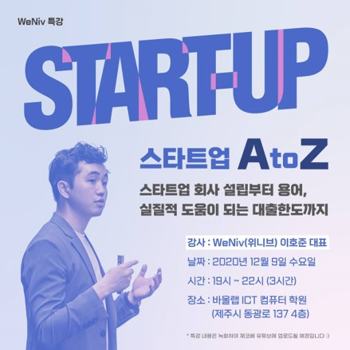
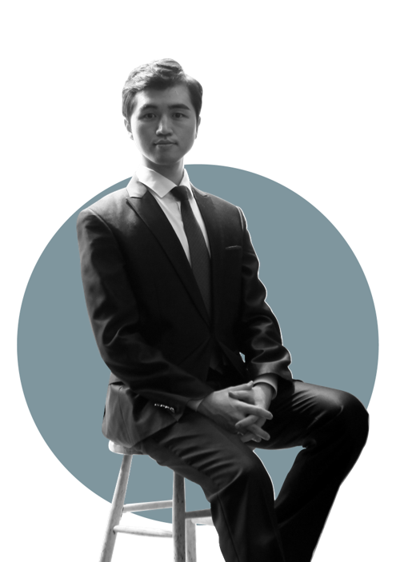
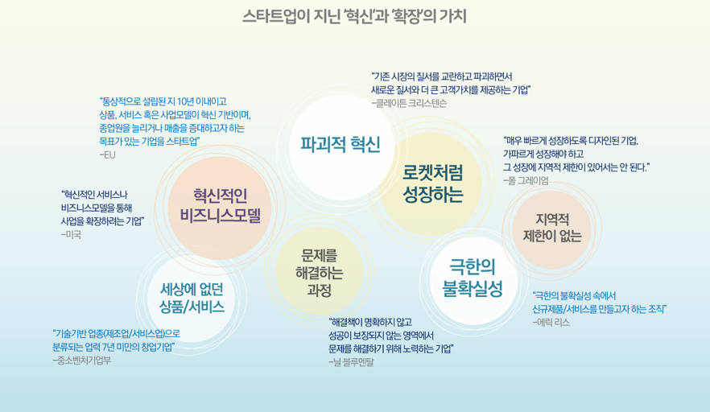
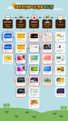
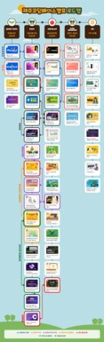
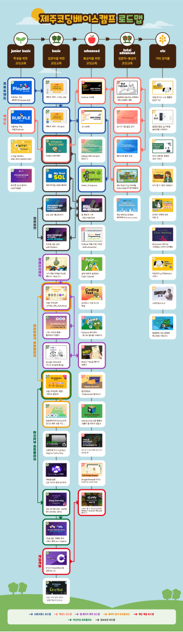
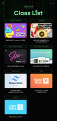
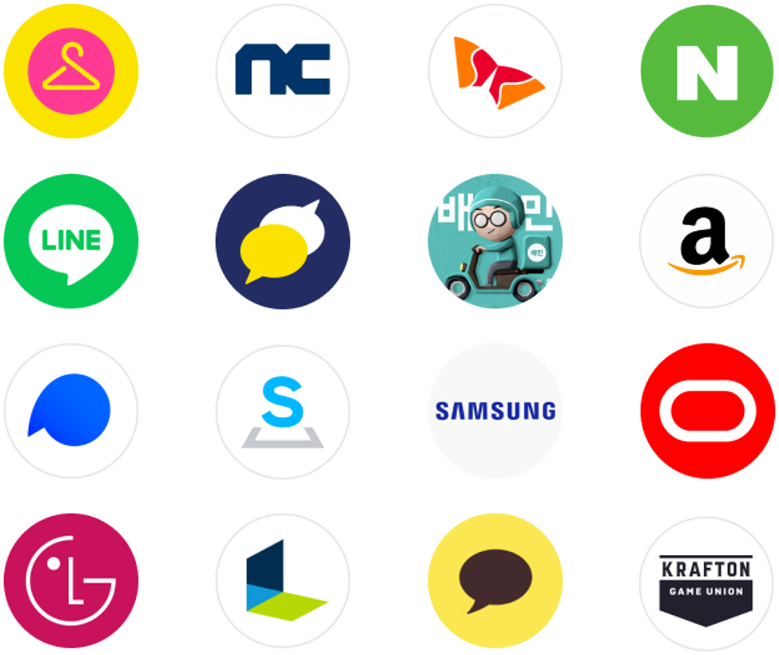
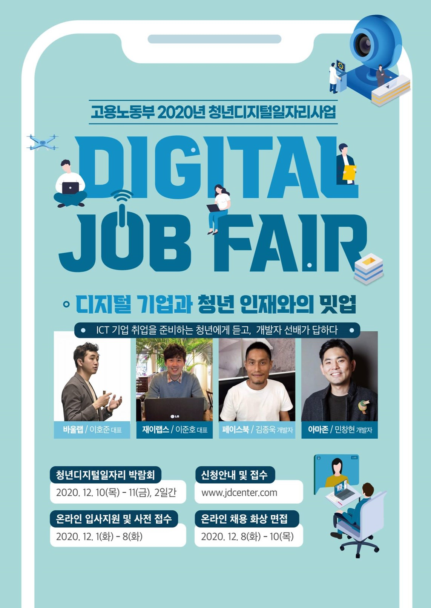

<!-- header: '' -->

# **강의 소개**

- 기간: 7월 1일 ~ 7월 6일
- 강사: 이호준, 한재현, 최원범, 김진
- 강의실: 교양동 강의실 4227호

---

해당 강의자료: https://github.com/weniv/presentation_marp

---

- 일자별 강의 내용
  - 7월 1일: 강의 소개, 수준 평가, 스타트업 개요, 노션과 이력서 형식
  - 7월 2일: 이력서 작성 방법, 개발자 이력서 셈플 보기
  - 7월 3일: 기본 알고리즘 및 코테 준비
  - 7월 4일: 취업과 창업에 사용하면 좋을 도구, 개발자 취업 준비 및 이력서
  - 7월 5일: 이력서 작성 방법
  - 7월 6일: 채용 공고 분석하기

---

- 강의 시간: 09:00 ~ 18:00
- 평가: 이력서 작성(토요일 오후수업까지 PDF로 제출, 제출확인 필)
- 링크: https://forms.gle/LPc4QCFXa8ibNLtd7
- 짧은 링크: https://weniv.link/MgViad

---

<!-- _class: lead -->

wifi가 제대로 작동하지 않을 수 있습니다.
wifi가 안된다면 휴대폰 테더링을 사용해주세요.

---

Coding을 전혀 모르는 학생의 비중이 50% 이상이면,
Coding에 대한 개념을 먼저 설명합니다.
Coding을 전혀 해보지 않은 분은 손을 들어주세요.

---

<!-- _class: lead -->

# 간단한 수준 평가

https://100.pyalgo.co.kr
(문제는 1번과 4번, 제한시간은 15분)

---

```python
# 1번: 주어진 리스트 내에 홀수를 찾아 합을 반환하는 solution 함수를 완성해주세요.

def solution(arr):
    pass

solution([1, 2, 3, 4, 5, 6])

```

---

```python
# 라이캣은 크리스마스 선물 룰렛 게임을 하고 있습니다.
# 룰렛에는 '쿠키 1개'부터 '쿠키 10개'까지 값이 들어 있습니다.
# 룰렛은 총 3번 돌릴 수 있고, 첫번째 시도에서 나온 값은 곱하기 1을 하고,
# 두번째 시도에서 나온 값은 곱하기 2를 하고
# 세번째 시도에서 나온 값은 곱하기 3을 하기로 하였습니다.
# 라이캣이 가져갈 쿠키의 수를 리턴하는 함수를 완성해주세요.

def solution(arr):
    pass

solution(['쿠키 3개', '쿠키 2개', '쿠키 5개']) # 22개

```

---

# 벤처 창업 실무

---

- 벤처 창업 실무 주요 내용
  - 창업의 개념과 특징
  - 창업 시스템 구축
  - 이력서 보는 법과 이력서 작성하는 법
  - 코딩테스트

---

소개자료: https://weniv.link/OubyA-

---

<!-- 사진 왼쪽과 오른쪽 배치 -->



이 강의는 대부분의 자료를 인프런 강의로 무료로 보실 수 있습니다. (강의 하는 모든 내용이 담겨있진 않습니다.)

---



통신장교(사령부 전산실)
한국공학기술연구원 팀장
신한금융그룹 정보보안팀
스타트업협회 부회장

현) 주식회사 위니브 대표
현) 바울랩 ICT 컴퓨터학원 대표
현) 바울랩 ICT 기술연구원 대표
현) 사도출판 대표

https://paullab.co.kr

---

1. 스타트업과 우리 이야기
2. 스타트업 창업
3. 스타트업의 성장
4. 제주의 스타트업

---

# 1. 스타트업과 우리 이야기

---

<!-- _class: lead -->

스타트업: 신생 기업

---

# 네이버 지식 백과

신생 창업기업을 뜻하는 말로 미국 실리콘밸리에서 처음 사용되었다. 보통 혁신적인 기술과 아이디어를 보유하고 있지만 자금력이 부족한 경우가 많고, 기술과 인터넷 기반의 회사로 고위험, 고수익, 고성장 가능성을 지니고 있다.

한편, 기업 가치가 10억 달러 이상인 스타트업은 유니콘(Unicorn)이라고 부르는데, 이는 많은 스타트업 중 크게 성공하는 스타트업이 드물어 상상 속에 존재하는 유니콘과 같다는 의미를 지니고 있다. 특히 기업 가치가 100억 달러 이상인 스타트업은 뿔이 10개 달린 상상 속 동물인 데카콘(Decacorn)이라고 부르는데, 이는 유니콘보다 더 희소가치가 있는 스타트업이라는 의미이다.

---

한국은 스타트업의 법률적 근거를 마련하기 위해 업종에 대한 제한이 있습니다.

EU나 미국 등은 업종과 상관없이 기술 기반일 경우 스타트업으로 인정하고 있어요.

---

<!-- _class: lead -->



---

<!-- _class: lead -->

거대하고 대단한 것을 하는 것이 아니라,
작은 것이라도 판을 변화시키려는 의지와 가치

---

<!-- _class: lead -->

낙타의 시대가 온다.

---

<!-- _class: lead -->

제가 생각하는 스타트업

---

<!-- _class: lead -->

판을 바꾸려는 의지와 방향성, 그리고 가치

---

<!-- _class: lead -->

그럼, 제가 바꾸려는 판은?

---

<!-- _class: lead -->

교육판

---

<!-- _class: lead -->

선생님, 더 배우고 싶어요.

---

<!-- _class: lead -->

내가 있어야 할 곳.

---

<!-- _class: lead -->

내가 할 수 있는 것.

---

<!-- _class: lead -->

기술의 교육 기회를 누구나 차등 없이 받을 수 있게 하는 것.

---

<!-- _class: lead -->

아니, 보람 있는 일로 적어도 하루 세끼는 굶지 않게 하는 것.

---

<!-- _class: lead -->

학생에게 그러한 길을 만들어주고 싶었습니다.

---

<!-- _class: lead -->

회사를 그만두지 않고, 천천히 준비해갔습니다.

---

<!-- _class: lead -->

회사 일도 정말 열심히 했습니다.
한 번 출근하면 2 ~ 3일은 퇴근을 안했어요.

---

<!-- _class: lead -->

퇴사와 창업

---

<!-- _class: lead -->

9년, 10만여명의 온오프라인 수강생

---

<!-- _class: lead -->

65개의 강좌, 5000여개의 영상

---

<!-- _class: lead -->

100여권의 무료 책, 300여명의 저자

---

<!-- _class: lead -->

10여개의 오픈소스 프로젝트, 100여명의 기여자

---

<!-- _class: lead -->

- 제주코딩베이스캠프
- 제주알고리즘베이스캠프
- 제주 웹 컨퍼런스
- 제주 AI 컨퍼런스

---

<!-- _class: lead -->

- https://livecorona.co.kr/
- https://flexngrid.com/
- https://stopwar.co.kr/
- https://sqlschool.co.kr/
- https://datagenerator.co.kr/
- https://algoview.co.kr/

---

<!-- _class: lead -->

카카오, 크래프톤, 메타(META) 등 다양한 기업에 취업한 수많은 학생들.
하버드, MIT, 스탠포드 등 다양한 학교에 진학한 학생들.
꼭 이름있는 곳이 아니더라도 '자신의 길'을 찾고 걸어가고 있는 학생들.

---

<!-- _class: lead -->

|        2020년        |        2021년        |             2022년              | 2022년                 |
| :------------------: | :------------------: | :-----------------------------: | ---------------------- |
|  |  |  |  |

---

<!-- _class: lead -->



---

<!-- _class: lead -->

K-Digital Training

---

<!-- _class: lead -->

100% 수료율 4회, 99%가 추천하는 전설의 부트캠프

---

<!-- _class: lead -->

주로 이스트소프트와 모두의 연구소와 함께 합니다.

---

<!-- _class: lead -->

누구나 하고 싶은 일을,
누구나 원하는 곳에서 하며,
누구나 주머니를 채워갈 수 있는 IT 교육

---

<!-- _class: lead -->

수강생에 행복에 더해
사회적 역할과
임직원과 임직원 가족들의 행복을

---

<!-- _class: lead -->

해달라고 해주는 교육이 아니라
누군가가 먹고살 수 있는 IT 교육을

---

<!-- _class: lead -->

우리 기업은 할 수 있지만,
누구나 못하는 그것은 무엇일까?

---

<!-- _class: lead -->

누군가는 신경 써야 하지만,
이익이 되지 않아 누구도 신경 쓰지 않은 곳은 어디일까?

자본이 비추는 밝은 곳 말고,
구석 한 모퉁이 해가 들지 않는 곳은 어디인가?

---

<!-- _class: lead -->

지금, 이러한 강의를 통해 돕습니다.
지금, 이러한 행위를 통해 돕습니다.
지금, 이러한 모임을 통해 돕습니다.

---

<!-- _class: lead -->

적어도 꿈을 꾸었을 때 그 길이 모호하지 않도록.
구체적이며 하루하루 이뤄갈 수 있도록.

---

<!-- _class: lead -->

우리는 다음 Step을 준비합니다.

---

# 2. 스타트업 창업

---

<!-- _class: lead -->

- 개인사업자(간이과세자와 일반과세자, 4,800만 원 미달과 이상)
- 법인사업자

---

<!-- _class: lead -->

간이과세는 포기할 수 있습니다.
간이과세는 사업에 제한이 있을 수 있습니다.

---

<!-- _class: lead -->

면세사업자(부가가치세 없음)
과세 사업자(부가가치세 10%)

---

<!-- _class: lead -->

사업자 등록을 위해서는 주소지부터 확보!
(임대차 계약서 필요하고, 집도 됩니다.)

---

<!-- _class: lead -->

세무서가서 사업자 등록

<끝>

---

<!-- _class: lead -->

업종에 따라서는 인허가를 받아야 할 수도 있음!
(저희 회사의 경우 학원과 출판사)

---

<!-- _class: lead -->

법인의 경우는 좀 더 까다롭습니다.
법인은 말 그대로 법인, 권리능력을 가집니다!
(대표 != 법인)

---

<!-- _class: lead -->

일단 공동 창업자가 있는 경우
지분 분배를 어떻게 할지 정해야 진행할 수 있습니다.

---

<!-- _class: lead -->

맡기세요. 법인은 혼자 준비하기 힘듭니다. 약 50만 원 정도.

---

<!-- _class: lead -->

통장개설 : 난이도 ★★★☆☆
매장에 카드기 : 난이도 ★☆☆☆☆
온라인 매장 : 난이도 ★★☆☆☆
공인인증서 : 난이도 ★★★☆☆
세금납부 : 난이도?
월급 : 난이도 ★★★☆☆
채용 : 난이도 ★★★★★
시스템구축 : 난이도 ★★★★☆
국가사업 : 난이도 ★★★★★★★★★★★★

---

<!-- _class: lead -->

국가사업의 경우, 본연의 길을 잃어버리기 쉽습니다.

---

<!-- _class: lead -->

또, 자생할 힘을 갖추기가 어렵습니다.(좀비기업)

---

<!-- _class: lead -->

원래 할 사업이었는데 맞춤형 사업이 나왔다!

---

<!-- _class: lead -->

https://bit.ly/3lUTcBS

---

## 2.1 채용

---

<!-- _class: lead -->

좋은 인재, 함께할 수 있는 사람.

---

<!-- _class: lead -->

입장을 바꿔 여러분들이라면
여러분 기업에 입사할 것인가?

---

<!-- _class: lead -->

Vision
소고기, 소고기, 소고기.

---

<!-- _class: lead -->

채용할 자금이 있는가?
지원 사업이 있는가? (지원 사업이 있어도 대표는 대부분 지원 불가)

---

<!-- _class: lead -->

그렇다면 대표는?

---

<!-- _class: lead -->

- 일자리 지원사업 통합 플랫폼
- 제주 테크노파크 등에서 나오는 청년 인건비 사업(월 180만원 지원)
- 제주 더큰내일센터(월 150만원 지원)

---

<!-- _class: lead -->



---

<!-- _class: lead -->

- 초기창업패키지
- 제주청년창업사관학교

---

## 2.2 시스템 구축

---

<!-- _class: lead -->

- 예전: Slack + Trello + Notion + GitHub + VSC
- 현재: Discord + Notion + Figma + GitHub + VSC + AI
- AI: Claude + Copilot + 미드저니 + Gemini

---

<!-- _class: lead -->

- 간트 차트와 칸반보드를 모두 지원하는 Notion
- 다만 속도 면에서 아쉬운 면이 있음
- 돈을 더 지불하더라도 속도가 빨라졌으면