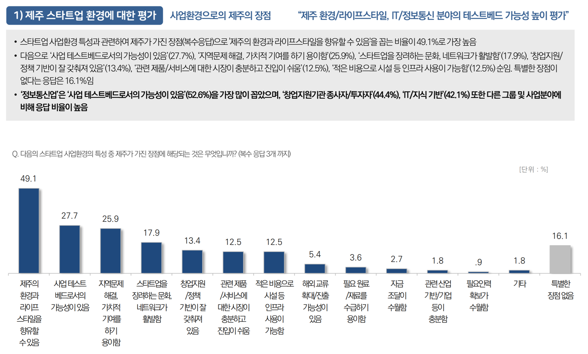

<!-- header: '' -->

# 3. 스타트업 성장

---

<!-- _class: lead -->

- 투자도 가려서 받아야 합니다.
- 투자를 받을 때 : https://nugu.money

---

<!-- _class: lead -->

##### 'How to Raise Money Its a Journey Not An Event' - 스티브 블랭크, 발췌

- Pre-Seed - MVP를 만들고 Product-Market Fit Test
- Seed - 성장 가속화 초기자금 확보
- Series A - 비즈니스 모델 검증
- Series B - 이익을 입증
- Series C - 1,000억
- IPO - 증시에 상장해 투자금 회수 단계

---

<!-- _class: lead -->

출처 : https://weniv.link/73HFER

---

<!-- _class: lead -->

출처 : https://weniv.link/73HFER

---

<!-- _class: lead -->

##### 'How to Raise Money Its a Journey Not An Event' - 스티브 블랭크, 발췌

1~3년 차 : 0~20억 원
4년 차 : 20억 원 ~ 60억 원
5년 차 : 60억 원 ~ 180억 원
6년 차 : 120억 원 ~ 360억 원
7년 차 : 240억 원 ~ 720억 원

---

<!-- _class: lead -->

고정비 절감
복잡도 최소화
불필요한 서류작업 X
빠른 의사결정
Avengers! - 작은 팀! 높은 성과!
확장성!!

---

<!-- _class: lead -->

Team!
자율성 보장
성장할 수 있는 환경
높은 연봉과 빠른 퇴근
명료한 Vision과 일의 목적 (국가사업을 하면 여기가 흔들립니다.)
지금의 팀원보다 더 좋은 팀원
(월급이 밀리는 것보다는, 혼자 시작하시는 편이 좋습니다.)

---

<!-- _class: lead -->

대부분의 스타트업들은 딴짓하느라 막상 사용자들의 사랑할만한 제품을 만들어내지 못합니다.
제품을 만들고, 고객과 소통하며, 운동하고 식사하고, 그 외에는 하지 마세요.
<How to Start a Startup, Stanford, 샘알트만>

---

<!-- _class: lead -->

1. 아이디어
2. 제품
3. 팀
4. 실행
5. 비즈니스 모델
6. 시장
7. 사명

---

1. 아이디어 - 세상에 좋은 아이디어는 너무 많습니다.
2. 제품
   2.1 고객이 사랑할 제품인지? 아니, 내가 사랑하는 제품인지.
   2.2 MVP 이후의 제품을, 어느 단계에서 어느 정도로 구현할 것인지
3. 팀 - 팀원 관리, 채용, 해고, 격려, 미션, 성과관리 등
4. 실행 - 빠른 실행! 빠른 포기!
5. 비즈니스 모델 - BM, 고객 확보, 유통 경로…(뒤에서 별도 설명)
6. 시장 - 회사가 MAX로 벌 수 있는 돈
7. 사명 - 가장 중요!

---

<!-- _class: lead -->

애자일, 린스타트업, 스프린트,
최소 기능 제품(Minimum Viable Product, MVP)
시장세분화, 거점시장, 잠재고객, 사용자 특징 분석, ROI,
핵심 기능과 역량, 경쟁력 수치화, 고객의 구매 과정 이해,
비즈니스 모델(BM) 설계, 신규 고객 유치 비용, 제품의 성장 전략,
브랜드 자산, 고객 자산, 단기, 중기, 장기 전략,
DAU(Daily Active User), WAU, MAU,
사용자당 방문 수, 사용자 체류시간,
고객 생애 가치, 고객 획득 비용 분석 등

---

<!-- _class: lead -->

일단, 부딪치며, 하나씩 알아가세요.
모두 다 준비하고 갈 수는 없습니다.

---

<!-- _class: lead -->

제주더큰내일센터
청년창업사관학교
제주창조경제혁신센터
제주혁신성장센터
스타트업베이
W360
제주테크노파크
ROUTE330
RIS 사업단
제주산학융합원
제주대학교링크플러스사업단

---

<!-- _class: lead -->

투자는 빚, 결국에 갚아야 하는 돈.
회사가 망하면?

---

<!-- _class: lead -->

자금이 부족하다면,
좀 더 안정적인 대출을 권합니다.

---

<!-- _class: lead -->

중소벤처기업진흥공단
2,000~5,000까지 저리로(연 2.x%) 대출 가능

---

<!-- _class: lead -->

신용보증재단
2,000~5억까지 저리로(연 2.x%) 대출 가능

---

<!-- _class: lead -->

신용대출도 신용이 있어야 합니다.
대표 월급액 신용등급에 중요합니다.
월급 밀렸다고 카드론 사용하지 마세요.
신용등급이 떨어져 대출 %가 올라갑니다.

---

<!-- _class: lead -->

개인신용대출
2,000까지는 (연4.x%)로 대출 가능

---

# 4. 제주의 스타트업

---

<!-- _class: lead -->

---

<!-- _class: lead -->

지역에 기반을 두고 있는
스타트업

---

<!-- _class: lead -->

30년 후 전국 228개 시군구 중 46% 사라지는 지방 소멸시대

---

<!-- _class: lead -->

지역 균형발전, 지역 일자리 창출…

---

<!-- _class: lead -->

집값, 출퇴근, 삶의 밀도.

---

<!-- _class: lead -->

---

<!-- _class: lead -->

---

<!-- _class: lead -->

---

<!-- _class: lead -->

제조업이 없는 제주도의
신성장 동력(도의 입장)

---

<!-- _class: lead -->

- 국내 최대 국제 관광지
- 서비스 검증/확산 용이
- 노비자 국제자유도시

---

<!-- _class: lead -->

- 스타트업 비치
- 글로벌 테스트베드

---

<!-- _class: lead -->

---

<!-- _class: lead -->

---

<!-- _class: lead -->

---

<!-- _class: lead -->

카카오
이스트소프트
넥슨
쏘카(타다)

---

<!-- _class: lead -->

다자요
EV PASS
해녀의 부엌
디스커버제주
캐치잇플레이
…
너무 많음!(특히 제주스타트업협회에!)
